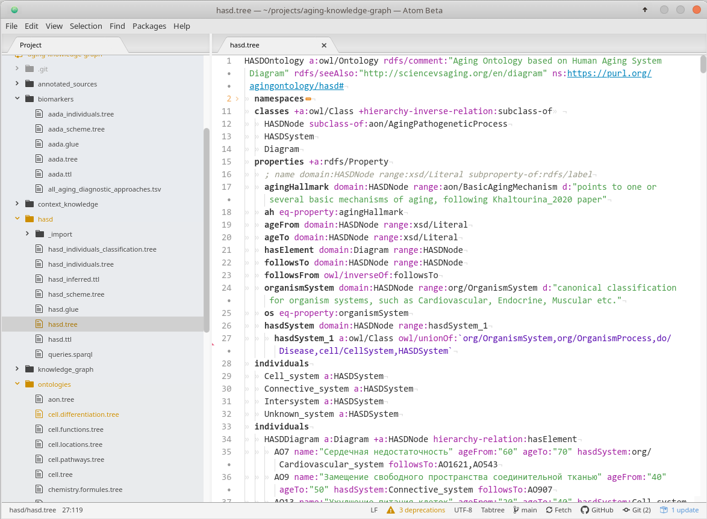

# Working with Tabtree files

Tabtree format is convenient to use for coding OWL ontologies and knowledge graphs, as it makes code more compact and readable.

## Short instruction

* Install Atom code editor
  * Add Tabtree plugin
* Install Git client
* Clone git repository from GitHub

## Detailed instruction

### Install and set up Atom

- Download and launch Atom installer [from here](https://atom.io/)

#### Set Light theme

I recommend to set the greyish-white background for editor background as the Tabtree syntax highlighter we install on the next step is optimized exactly for this color mode.

After downloading and installation of the Atom code editor, choose Light theme by these steps:
 - Press `Ctrl-,`
 - Choose `Themes`
 - In `UI Theme` and `Syntax Theme` choose `Atom Light`

#### Install Tabtree plugin

  - Press `Ctrl-,`
  - Choose `Install`
  - In the search field type in `tabtree`
  - Press `Install` button in `language-tabtree` bar

Now you've got something like this:

### Install Git client for Windows

#### Install Git support

- Download and run installer [from here](https://git-scm.com/download/win). Choose standalone installer, and most probably you would need 64-bit Git

#### Install Sourcetree - a Git client

- Download and run installer [from here](https://www.sourcetreeapp.com/)
- Launch Sourcetree
- Choose `New` from the top menu
- Choose `Clone from URL`
- In `Source URL` type in Geroontology repository address: `git@github.com:prozion/geroontology.git`
- Choose folder where to upload the files from the repository
- Press `Clone`

### Open a project to work in Atom

Now, when you have downloaded Geroontology files, let's go back to Atom editor

- In the top menu: `File` - `Add Project Folder...`
- Navigate to the folder with downloaded repository and select this folder, press `Ok`

In the tree view pane you will see this folder with all the files inside it. You can double-click `geroontology/tabtree/geroontology.tree` to open the file and start working over ontology!
