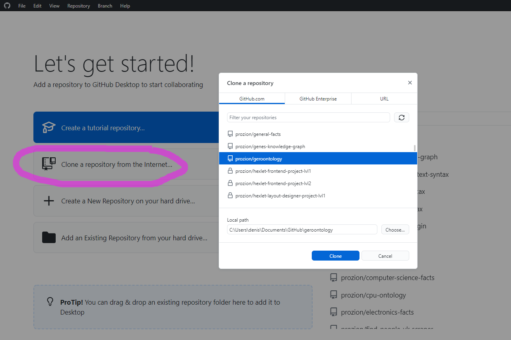
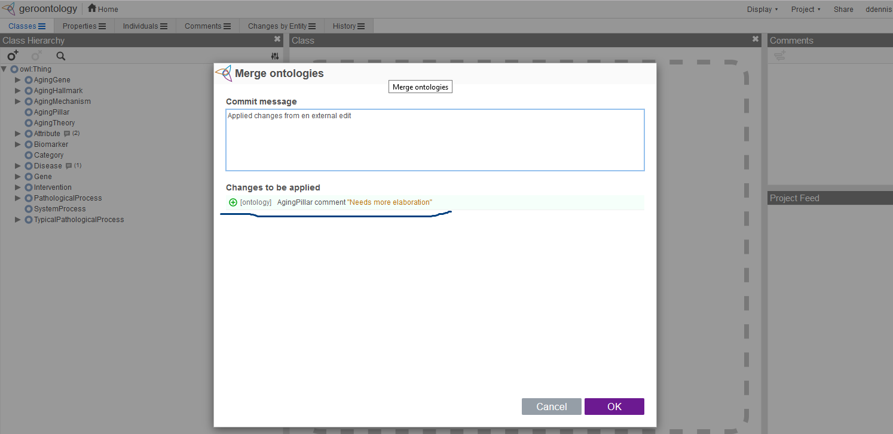

# Working with Tabtree files of Geroontology

Tabtree is a language/format convenient to use for coding OWL ontologies and knowledge graphs, as it makes code more compact and readable.

This manual will help you to install all the necessary tools, and commence a happy development of Geroontology through tabtree files.

## Short instruction

* Install Atom code editor
  * Add Tabtree plugin
* Install Git client
* Clone git repository from GitHub

## Detailed instruction

### Install and set up Atom

- Download and launch Atom installer [from here](https://atom.io/)

#### Set Light theme

I recommend to set the greyish-white background as the Tabtree syntax highlighter we install in the next step is optimized exactly for this color mode.

After downloading and installation of the Atom code editor, choose Light theme by these steps:
 - Press `Ctrl-,`
 - Choose `Themes`
 - In `UI Theme` and `Syntax Theme` choose `Atom Light`

#### Install Tabtree plugin

  - Press `Ctrl-,`
  - Choose `Install`
  - In the search field type in `tabtree`
  - Press `Install` button in `language-tabtree` bar

Now you've got something like this:

### Install Git client for Windows

#### Install Git support

- Download and run [Git-scm installer](https://git-scm.com/download/win). Choose standalone installer, and most probably you would need 64-bit Git

#### Install GitHub Desktop - a Git client

- Download and run [GitHub Desktop installer](https://desktop.github.com/)
- Launch GitHub Desktop and sign in to Github (You will need an account there anyways, to be able to push changes back to Github).
- (And tell me your login name, so I grant you access rights)
- Clone Geroontology repository, by selecting it in the list of available repos `git@github.com:prozion/geroontology.git`. Like in the picture below.

----

- Don't forget to choose folder in the right place on your disk, where files will be uploaded to.
- Press `Clone`

### Edit ontology with Atom

Now, when you have downloaded Geroontology files, let's go back to Atom editor

- In the top menu: `File` - `Add Project Folder...`
- Navigate to the folder with downloaded repository and select this folder, press `Ok`

In the tree view pane you will see this folder with all the files inside it. You can double-click `geroontology/tabtree/geroontology.tree` to open the file and start working over ontology!

Let's try to add some more data to ontology. For example comment on `AgingPillar` class.

### Push changes and load ontology to WebProtege

In GitHub Desktop app press `Commit to main` and then `push`

-----

After commit you will see all the changes made in the project since last `git pull` (the state of the latest commit, before the current one). In the green background line we see our new addition.

-----

`Push` command sends new versions of files back to Github repository. And there, special server script launches translation from `geroontology.tree` file to `geroontology.ttl` file in the standard Turtle/OWL syntax.

After a minute or so, you can see the [changed ttl file](https://raw.githubusercontent.com/prozion/geroontology/builds/turtle/geroontology.ttl). You are welcome to save it on the disk and upload to some ontology editor or viewer.

-----

Let's see how it looks like in the case of WebProtege.

- Login to [WebProtege](https://webprotege.stanford.edu/#projects/64f29fb1-bf87-480c-b221-73e9928490b4/edit/Classes)
- Go to Geroontology project
- Choose `Project` - `Apply External Edits`

----

Then choose geroontology.ttl file saved locally on the previous step. In my case I have saved this file straight to Desktop.

-----

After selecting and uploading the file, Webprotege displays what changes are to be made.

------

Click OK and check changes. If to open `Details` pane for`AgingPillar` class, we see that, indeed, our `rdfs:comment` has been added.

-----
