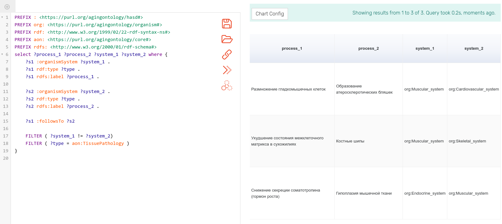

# Преобразование Системной схемы старения человека в граф знаний

## Введение

В своей работе по разгадке феномена старения, исследователи сталкиваются с постоянно растущим объемом информации и биологических данных. Эти данные обычно происходят из двух источников - текстов научных статей, и баз данных (которые основную долю своего содержания берут также из научных публикаций).

С текстами существует такая проблема: несмотря на то, что смысл текста хорошо понимается квалифицированным читателем, "понимание" обычного текста до сих пор остается сложной задачей для компьютера. Поэтому для поиска нужных фактов исследователи по-прежнему вручную просматривают публикации, что является процессом и долгим, и не гарантирующим хоть сколько-то полный охват материала.

Ситуация с базами данных тоже не идеальна - для каждой из них существует отдельный порядок доступа к информации - это могут быть как разные интерфейсы (API) доступа для программ-скраперов, так и разные форматы представления данных.

В результате, при изучении сложной, и далеко не до конца еще раскрытой картины биологических процессов старения, мы не можем опереться на единую базу известных фактов и результатов экспериментов. Информация добывается по частям из разных мест - и из статей и из баз данных, и сводится воедино уже в голове исследователя.

Однако такой порядок работы является довольно медленным, а в силу того, что у каждого человека в голове формируется своя модель предметной области - зачастую наблюдаются проблемы в коммуникации идей и знаний.

Для более эффективной работы сообщества, хорошо было бы иметь единую формальную модель организма и процессов старения, а также некоторый общий контейнер, в котором бы на базе этой формальной модели хранились и все время добавлялись новые актуальные факты предметной области. Далее с этими фактами могли бы производиться различные расчеты, преобразования и моделирование. Что позволило бы автоматически получать новые знания, а также автоматически генерировать гипотезы. То есть полномасштабно применять современные компьютерные мощности к этому сложному направлению биологических исследований.

Как одно из возможных решений я хотел бы предложить ***граф знаний***.

Граф знаний хранит сущности в виде своих вершин и связи между ними в виде ребер. Сущности могут быть патологиями, органами, белками или генами - любыми объектами, фигурирующими в литературе или базах данных. Связи могут быть биохимическими реакциями, следствиями, соответствиями и т.д. Также он может включать в себя онтологию - субграф с классификацией сущностей и связей. Именно онтология позволяет интегрировать данные из различных источников.

Прелесть подобного графа заключается в том, что мы, как и в базах данных, можем осуществлять на нем запросы и находить субграфы по заданному шаблону, то есть производить поиск информации и, собственно, новых фактов через раннее не замеченные взаимосвязи сущностей.

В этом эссе я покажу, как можно взять небольшую существующую базу данных в области исследований старения и преобразовать ее в граф знаний. А также продемонстрирую некоторые варианты его использования.

## Методы

### Выбор исходной базы данных

В качестве компактного, но актуального источника фактов я выбрал [Системную схему старения человека (СССЧ)](http://sciencevsaging.org/). СССЧ представляет из себя диаграмму, где в графическом виде показано, как в организме человека связаны различные патологические процессы, ведущие к старению и смерти.

*Рис. 1. Фрагмент Системной схемы старения человека. Узлы диаграммы и связи между узлами имеют разные типы, это показано различиями в их закраске. При клике мышкой на узле появляется всплывающее окно с более подробной информацией по выбранному узлу.*

В графической диаграмме, как таковой, уже содержится информация о сущностях и их взаимосвязях. Однако визуальное представление дополнительно к своим достоинствам имеет и ряд недостатков. Например, такую диаграмму не так легко редактировать, сохранять историю изменений и версии, а также разбивать работу над схемой на несколько веток. Еще сложнее соединять результаты независимой работы из разных веток, по аналогии с практиками, принятыми в разработке программного обеспечения. Расширение схемы, добавление на нее новых типов данных, таких как ссылки на соответствующие исследования, также требует большого количества работы

Перевод Системной схемы старения человека на модель графа знаний с прилагающейся онтологией позволит легко расширять схему, добавлять новые типы данные и сами данные, развивать свой вариант схемы, отпочковывая новый проект от базового.

Таким образом подобная работа, помимо демонстрации принципов, может принести пользу сообществу исследователей старения и возможно послужит отправной точкой для роста в сторону подробного графа знаний процессов старения.

### Обработка данных, содержащихся в СССЧ

Конечно, программисту требуется не картинка, а то, что можно обработать программным кодом - цифровая последовательность чего-либо: символов, пикселов и т.д. Схема старения предусматривает сериализацию, то есть представление диаграммы в виде текстового кода. Веб-страница СССЧ представляет данные в формате JSON, их можно увидеть, открыв код страницы в браузере нажатием клавиш `Ctrl-U`. Однако я использовал сериализацию последней версии CCCЧ 67.3 в файлах формата CSV, любезно предоставленных мне Алексеем Алексеевым.

Несмотря на то, что можно получить Схему старения в текстовом представлении, оно еще не решает проблем, обозначенных выше. Так как форматы, на которых происходит сериализация (JSON, CSV), сами по себе громоздки и не предназначены для работы напрямую, независимо от инструмента визуализации. Также у них нет средств для описания семантики данных. Такие средства дает модель графа знаний и язык онтологий OWL.

Остановимся подробнее на представлении графа знаний. Эффективно любой граф можно представить как набор упорядоченных троек, где первый и третий элемент тройки обозначают смежные вершины, а второй элемент - связывающее эти вершины ребро. Этот же принцип справедлив и для графов знаний. Для них существует широко используемая модель, реализующая такой принцип, она называется RDF (Resource Description Framework). Тройки можно записывать в XML, но в сообществе разработчиков уже имеется консенсус, что в отличие от машины, для человека данный формат является громоздким и трудным для чтения. Вместо XML используется более легкий для восприятия формат Turtle (Terse RDF Triple Language) и обычно так и указывается - "данные в формате RDF/Turtle", то есть методология и через косую черту - формат ее представления.

Язык онтологий OWL (Web Ontology Language) работает поверх RDF и позволяет описывать *семантику* - типы графовых вершин (объектов) и ребер (взаимосвязей объектов и типы их параметров), а также правила по которым исходный граф может расширяться, образуя новые связи и сущности.

Итак, задача сводится к тому, чтобы преобразовать данные в формате CSV в формат RDF/Turtle, и дополнительное описав на OWL минимальную онтологию, соответствующую семантике узлов и связей на диаграмме.

Как язык программирования я использовал язык [Clojure](https://clojure.org/), кодирование производил в редакторе кода [Atom](https://atom.io/). Clojure удобен тем, что тесно интегрирован с экосистемой языка Java, на котором имеется богатая коллекция библиотек и приложений, работающих с RDF графами. Помимо этого, Clojure сам по себе является элегантным и эффективным языком, поддерживающим функциональную парадигму программирования, которая ускоряет время разработки и идеально подходит для задач преобразования данных.

*Рис. 2. Пример кода на языке Clojure, конвертирующего исходный CSV файл в файл RDF графа знаний*

Помимо непосредственно программирования, выяснилось, что хоть формат Turtle и легко читаем, кодировать на нем онтологию и редактировать части графа знаний не очень удобно. Поэтому я дополнительно использовал промежуточный формат Tabtree. Это мой собственный изобретенный формат для записи графов знаний. Он позволяет еще более компактно сериализовывать графы знаний и подобно программному коду разбивать их на части.

Вначале из нескольких CSV файлов генерировались соответствующие представления в Tabtree, в том же формате отдельно создавался файл онтологии, затем эти файлы собирались в один большой Tabtree, который, в свою очередь, конвертировался в один большой файл Turtle.

Работа с форматом Tabtree проводилась в том же редакторе кода Atom, где мною специально под данный формат был создан [плагин для подсветки синтаксиса](https://github.com/prozion/language-tabtree), делающий работу с кодом онтологий и графов знаний еще более удобной.

*Рис. 3. Пример кода Tabtree с подсветкой синтаксиса в редакторе Atom. Файл онтологии Схемы старения*

Запуск кода чтения и преобразования CSV в Tabtree, а затем в RDF/Turtle производился просто из линукс-консоли c загруженной REPL-сессией Clojure проекта.

*Рис. 4. REPL (Read-Eval-Print Loop) - интерактивная среда программирования с полным доступом к разрабатываемому коду, его переменным и функциям.*

`(build-hasd)` *&ndash; головная функция, которая производит все действия по созданию RDF/Turtle файла через вызов других функций. Создана специально для удобства вызова из REPL сессии.*

### Расширение СССЧ

В Схеме старения всем процессам присваивается определенный тип в зависимости от системы, в контексте которой процесс происходит. На диаграмме каждому такому типу соответствует свой цвет - им закрашиваются как вершины, так и линии, их соединяющие. Однако эта система показалась мне несколько "рыхлой", так как процесс должен иметь строго один тип. Но в некоторых случаях процесс можно одинаково отнести как, скажем, к нервной системе, так и к системе клетки. Мне показалось, что следует внести дополнительную классификацию, в рамках которой можно более однозначно типизировать узлы.

Поэтому я добавил даже несколько классификаций процессов, которые дублирует классификацию, принятую изначально:

* классификация по системам организма
* классификация по отношению к девяти ключевым процессам старения согласно [статье Дарьи Халтуриной и соавторов](https://doi.org/10.1016/j.mad.2020.111230)
* классификация по уровню системы, на которой мы можем локализовать патологический процесс.

*Рис. 5. Последняя классификация, как она задана в файле онтологии*

### Пример работы с графом знаний

#### WebProtege

Получившийся файл Turtle, в котором хранится граф знаний Схемы старения можно загрузить в онлайн-редактор онтологий [WebProtege](https://webprotege.stanford.edu/#projects/513cd457-cf09-42e3-a3b6-3b4c1cdd1ad3/edit/Classes).

Данный редактор способен отображать списки элементов графа и классы онтологии, и даже показывать графически части графа знаний, как видно ниже на скриншоте.

*Рис. 6. Онлайн редактор онтологий Webprotege. Слева панель со списком экземпляров (изначально узлов диаграммы - патологических процессов), справа - визуализация части схемы, начинающейся с процесса 'Кальцификация миоцитов'. Все остальные связи между узлами, кроме причинно-следственной (followsTo) отфильтрованы для ясности визуализации.*

#### GraphDB

К сожалению, Webprotege не позволяет делать запросы к графу знаний. Для этого следует воспользоваться другим бесплатным приложением, [GraphDB](https://www.ontotext.com/products/graphdb/graphdb-free/)

*Рис. 7. Интерфейс GraphDB, доступный через браузер*

GraphDB устанавливается локально на компьютере и предоставляет доступ к своему пользовательскому интерфейсу через браузер, запуская локальный сервер (localhost). Но при необходимости командной работы, возможно настроить доступ к одному и тому же графу знаний через интернет. Я сделал это на своем арендуемом сервере VDS (Virtual Dedicated Server) на котором имеется операционная система Linux Ubuntu с возможностью установки любых приложений. Доступ к интефейсу работает по адресу https://demo.denis-shirshov.ru/graphdb. Там можно проверить изложенные далее примеры или составить собственные SPARQL запросы к графу знаний СССЧ.

*SPARQL (SPARQL Protocol and RDF Query Language)* &ndash; язык запросов к графу знаний, определяющий произвольные паттерны графа и предписывающий вернуть конкретные части графа, которые этим паттернам соответствуют. Поиск частей графа по такому запросу обычно осуществляет программа, называемая *SPARQL engine*.

Допустим, нужно найти все переходы, где начальный и конечный процессы принадлежат различным системам организма и при этом оба они происходят на тканевом уровне. Вот как это будет выглядеть в интерфейсе GraphDB

*Рис. 8. Интерфейс ввода SPARQL запросов в приложении GraphDB: Слева располагается панель редактора SPARQL с развитым функционалом редактирования и сохранения запросов, что существенно превосходит возможности "классики жанра" &ndash; окна редактирования SPARQL в редакторе онтологий Protege (десктопная версия). Справа находится панель с результатом запроса в виде таблицы. Колонки таблицы задаются в самом запросе*

Как видно, на данный запрос нашлось три перехода. Посмотрим теперь сколько переходов будет если мы потребуем не точного совпадения по тканевому уровню, а лишь ограничим локализацию тканевым уровнем. То есть также попадут процессы, соответствующие клеточному, ядерному и т.д. уровням, то есть уровням более локальным, нежели тканевой.

В случае с хранением данных в реляционной базе данных это была бы уже нетривиальная задача, в то время как граф знаний и онтологии позволяют решить ее довольно легко. Для этого необходимо лишь провести *логический вывод (inference)*, на основе правил, указанных в онтологии Схемы старения. В частности в онтологии указывается иерархия уровней локализации патологического процесса, как уже было показано на Рис. 5. Логический вывод устанавливает, что если процесс принадлежит, например, клеточному уровню, который является подклассом тканевого уровня, то следовательно процесс принадлежит и тканевому уровню. В терминах графа это означает, что проводится новое ребро, связывающее вершину данного процесса с вершиной класса *TissuePathology*.

Благодаря логическому выводу, вместо трех мы получаем уже пять результатов:

*Рис. 9. Запрос с включением логически выведенных данных в результат. Переключение в этот режим происходит при клике на иконке с двойной стрелкой в правой части панели редактора SPARQL запроса*

## Обсуждение

Какие варианты дальнейшего развития данной работы? Как стратегический ориентир я вижу создание графа знания процессов старения в целом. Возможно, имеет смысл продолжать двигаться в эту сторону небольшими шагами. Например интегрировать уже имеющийся граф знаний с другими диаграммами и таблицами, такими как
* Таблица [All aging diagnostics approaches](https://docs.google.com/spreadsheets/d/1suMEVlMHKyTHwWzafBF0rmEAIPY0CowxxjEFvhO2TIA/edit#gid=853086944) составленной Open Longevity.
* База данных генов, ассоциированных со старением [Open genes](https://open-genes.com), тоже проект Open Longevity
* Таблицы генов, упоминаемых в абстрактах Pubmed рядом с ключевыми словами связанными со старением. Составлены Еленой Смирновой.

При интеграции будет необходимо расширять и улучшать саму онтологию предметной области (старения), оттачивать точность используемых в графе знаний понятий и концепций (классов онтологии, их свойств и экземпляров). Чем более это будет командная работа, с обсуждениями и дискуссиями экспертов - тем качественнее получится конечный граф знаний и тем точнее можно будет извлекать из него желаемые факты.

В качестве инcтрументов для работы над онтологией, хотелось бы предложить два приложения. Первое уже упоминалось в данном эссе, это WebProtege. В этом приложении возможно работать с онтологией, используя всю терминологию языка OWL, создавать треды обсуждения конкретных артефактов онтологии, экспортировать результат в RDF/XML и RDF/Turtle. WebProtege сегодня широко задействуется в инженерии знаний, в частности он [использовался](https://link.springer.com/chapter/10.1007/978-3-642-16438-5_6) при работе над последней редакцией международного классификатора болезней ICD-11.

Второе приложение - это Miro. В нем удобно коллективно работать над майндмапами (деревьями понятий). [Пример майндмапа](https://miro.com/app/board/uXjVOnUzFwY=) относительно понятия **Старение**, созданного Еленой Смирновой. Этот майндмап может использоваться как источник экспертного мнения для последующего его переноса в онтологию на языке OWL и интеграцию в граф знаний.

*Рис. 10. Начало работы над майндмапом концепции старения. Также в Miro возможно добавлять на доску сопутствующую информацию: рисунки-диаграммы, статьи и т.д.*

Под вопросом пока остается инструментарий визуализации. В идеале хотелось бы иметь возможность генерировать графическую диаграмму по читабельности сравнимую с существующей диаграммой Системной схемы старения. Это будет заметный шаг вперед, т.к. можно будет генерировать целую плеяду схем на основе данных по разным срезам графа знаний.

Есть еще ряд идей относительно графа знаний, которые я не стал излагать в тексте эссе, чтобы не перегружать его деталями. Например интеграция со стандартом SBGN, слияние онтологии старения с онтологией BioPAX, онтологическая аннотация текстов научных публикаций и т.д. Эти темы можно будет обсудить отдельно, в зависимости от предпочтений и заинтересованности коллег.
