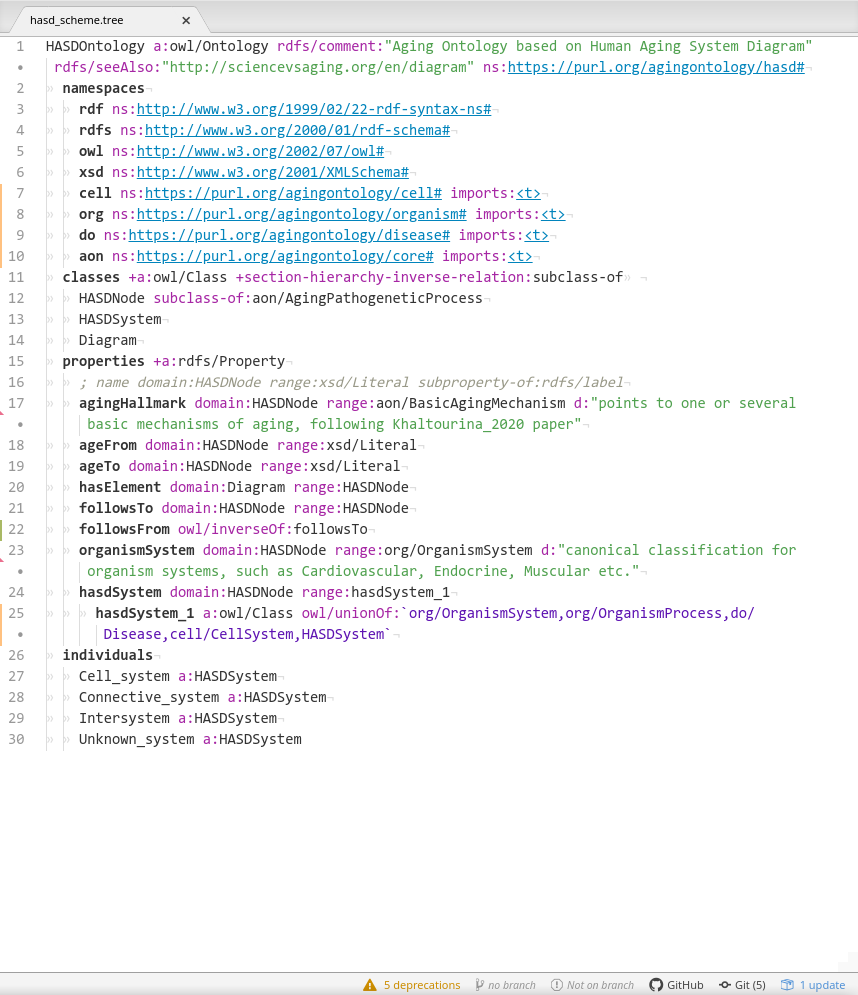

# Преобразование Системной схемы старения человека в граф знаний

## Введение

В своей работе по разгадке феномена старения, исследователи сталкиваются с постоянно растущим объемом информации и биологических данных. Эти данные обычно происходят из двух источников - текстов научных статей, и баз данных (которые основную долю своего содержания берут также из научных публикаций).

С текстами существует такая проблема: несмотря на то, что смысл текста хорошо понимается квалифицированным читателем, "понимание" обычного текста до сих пор остается сложной задачей для компьютера. Поэтому для поиска нужных фактов исследователи по-прежнему вручную просматривают публикации, что является процессом и долгим, и не гарантирующим хоть сколько-то полный охват материала.

Ситуация с базами данных тоже не идеальна - для каждой из них существует отдельный порядок доступа к информации - это могут быть разные интерфейсы (API) доступа для программ-скраперов, так и разные форматы представления данных.

В результате, при изучении сложной, и далеко не до конца еще раскрытой картины биологических процессов старения, мы не можем опереться на единую базу известных фактов и результатов экспериментов. Информация добывается по частям из разных мест - и из статей и из баз данных, и сводится воедино уже в голове исследователя.

Однако такой порядок работы является довольно медленным, а в силу того, что у каждого человека в голове формируется своя модель предметной области - зачастую наблюдаются проблемы в коммуникации идей и знаний.

Для более эффективной работы сообщества, хорошо было бы иметь единую формальную модель организма и процессов старения, а также некоторый общий контейнер, в котором бы на базе этой формальной модели хранились и все время добавлялись новые актуальные факты предметной области. Далее с этими фактами могли бы производиться различные расчеты, преобразования и моделирование. Что позволило бы автоматически получать новые знания, а также автоматически генерировать гипотезы. То есть полномасштабно применять современные компьютерные мощности.

Как одно из возможных решений я хотел бы предложить ***граф знаний***.

Граф знаний хранит сущности в виде своих вершин и связи между ними в виде ребер. Сущности могут быть патологиями, органами, белками или генами - любыми объектами фигурирующими в литературе или базах данных. Связи - биохимическими реакциями, следствиями, соответствиями и т.д. Также он может включать в себя онтологию - субграф с классификацией сущностей и характеристику (семантику) связей. Именно онтология позволяет интегрировать данные из различных источников.

Прелесть подобного графа заключается в том, что мы, как и в базах данных, можем осуществлять на нем запросы и находить субграфы по заданному шаблону, то есть производить поиск информации и, собственно, новых фактов через раннее не замеченные взаимосвязи сущностей.

В этом эссе я покажу, как можно взять небольшую существующую базу данных в области исследований старения и преобразовать ее в граф знаний. А также продемонстрирую некоторые варианты его использования.

## Методы

### Выбор исходной базы данных

В качестве компактного, но актуального источника фактов я выбрал [Системную схему старения человека (СССЧ)](http://sciencevsaging.org/). СССЧ представляет из себя диаграмму, где в графическом виде показано, как в организме человека связаны различные патологические процессы, ведущие к старению и смерти.

*Фрагмент Системной схемы старения человека. Узлы диаграммы и связи между узлами имеют разные типы, это показано различиями в их закраске. При клике мышкой на узле появляется всплывающее окно с более подробной информацией по выбранному узлу.*

В графической диаграмме, как таковой, уже содержится информация о сущностях и их взаимосвязях. Однако визуальное представление дополнительно к своим достоинствам имеет и ряд недостатков. Например, такую диаграмму не так легко редактировать, сохранять историю изменений и версии, а также разбивать работу над схемой на несколько веток. Еще сложнее соединять результаты независимой работы из разных веток, по аналогии с практиками, принятыми в разработке программного обеспечения. Расширение схемы, добавление на нее новых типов данных, таких как ссылок на соответствующие исследования, также требует большого количества работы

Перевод Системной схемы старения человека на модель графа знаний с прилагающейся онтологией позволит легко расширять схему, добавлять новые типы данные и сами данные, развивать свой вариант схемы, отпочковывая новый проект от базового.

### Обработка данных, содержащихся в СССЧ

Конечно, программисту требуется не картинка, а то, что можно обработать программным кодом - цифровая последовательность чего-либо: символов, пикселов и т.д. Схема старения предусматривает сериализацию, то есть представление диаграммы в виде текстового кода. Веб-страница СССЧ представляет данные в формате JSON, их можно увидеть, открыв код страницы в браузере нажатием клавиш `Ctrl-U`. Однако я использовал сериализацию последней версии CCCЧ 67.3 в файлах формата CSV, любезно предоставленных мне Алексеем Алексеевым.

Несмотря на то, что можно получить Схему старения в текстовом представлении, оно еще не решает проблем, обозначенных выше. Так как форматы, на которых происходит сериализация (JSON, CSV), сами по себе громоздки и не предназначены для работы напрямую, независимо от инструмента визуализации. Также у них нет средств для описания семантики данных. Такие средства дает модель графа знаний и язык онтологий OWL.

Остановимся подробнее на представлении графа знаний. Эффективно любой граф можно представить как набор упорядоченных троек, где первый и третий элемент тройки обозначают смежные вершины, а второй элемент - связывающее эти вершины ребро. Этот же принцип справедлив и для графов знаний. Для них существует широко используемая модель, реализующая такой принцип, она называется RDF (Resource Description Framework). Тройки можно записывать в XML, но в сообществе разработчиков уже имеется консенсус, что в отличие от машины, для человека данный формат является громоздким и трудным для чтения. Вместо XML используется более легкий для восприятия формат Turtle (Terse RDF Triple Language) и обычно так и указывается - "данные в формате RDF/Turtle", то есть методология и через косую черту - формат ее представления.

Язык онтологий OWL (Web Ontology Language) работает поверх RDF и позволяет описывать *семантику* - типы графовых вершин (объектов) и ребер (взаимосвязей объектов и типы их параметров), а также правила по которым исходный граф может расширяться, образуя новые связи и сущности.

Итак, задача сводится к тому, чтобы преобразовать данные в формате CSV в формат RDF/Turtle, и дополнительное описав на OWL минимальную онтологию, соответствующую семантике узлов и связей на диаграмме.

Как язык программирования я использовал язык Clojure, кодирование производил в редакторе кода Atom. Clojure удобен тем, что тесно интегрирован с экосистемой языка Java, на котором имеется богатая коллекция библиотек и приложений, работающих с RDF графами.

*Пример кода на языке Clojure, конвертирующего исходный CSV файл в файл RDF графа знаний*

Помимо непосредственно программирования, выяснилось, что хоть формат Turtle и легко читаем, кодировать на нем онтологию и редактировать части графа знаний не очень удобно. Поэтому я дополнительно использовал промежуточный формат Tabtree. Это мой собственный изобретенный формат для записи графов знаний. Он позволяет еще более компактно сериализовывать графы знаний и подобно программному коду разбивать их на части.

Вначале из нескольких CSV файлов генерировались соответствующие представления в Tabtree, в том же формате отдельно создавался файл онтологии, затем эти файлы собирались в один большой Tabtree, который, в свою очередь, конвертировался в один большой файл Turtle.

Работа с форматом Tabtree проводилась в том же редакторе кода Atom, где мною специально под данный формат был создан [плагин для подсветки синтаксиса](https://github.com/prozion/language-tabtree), делающий работу с кодом онтологий и графов знаний еще более удобной.

*Пример кода Tabtree с подсветкой синтаксиса в редакторе Atom. Файл онтологии Схемы старения*

Запуск кода чтения и преобразования CSV в Tabtree, а затем в RDF/Turtle производился просто из линукс-консоли c загруженной REPL-сессией Clojure проекта.

*REPL (Read-Eval-Print Loop) - интерактивная среда программирования с полным доступом к разрабатываемому коду, его переменным и функциям.*

`(build-hasd)` *&ndash; головная функция, которая производит все действия по созданию RDF/Turtle файла через вызов других функций. Создана специально для удобства вызова из REPL сессии.*

### Пример работы с графом знаний

Получившийся файл Turtle, в котором хранится граф знаний Схемы старения можно загрузить в онлайн-редактор онтологий [WebProtege](https://webprotege.stanford.edu/).

Данный редактор способен отображать списки элементов графа и классы онтологии, и даже показывать графически части графа знаний, как видно ниже на скриншоте.

*Онлайн редактор онтологий Webprotege. Слева панель со списком экземпляров (изначально узлов диаграммы - патологических процессов), справа - визуализация части схемы, начинающейся с процесса 'Кальцификация миоцитов'. Все остальные связи между узлами, кроме причинно-следственной (followsTo) отфильтрованы для ясности визуализации.*
